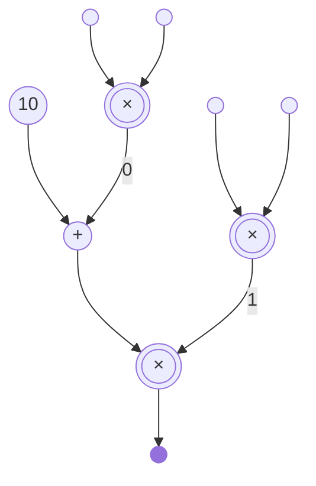

# Arith(metic)-Circ(uit)

**Arith-Circ** is an embedded domain-specific language for building *arithmetic
circuits*, a low-level universal model of computation. Given such a circuit, its
execution on some given inputs can be provably verified very efficiently (in
particular, much more efficiently than simply re-executing the circuit) with a
cryptographic proof system such as [Groth16](https://eprint.iacr.org/2016/260).

```haskell
tenAddProdTimesProd :: ArithCirc Fr
tenAddProdTimesProd = execCircBuilder $ do
  w <- var <$> input; x <- var <$> input
  y <- var <$> input; z <- var <$> input
  let wx = w `mul` x
  let yz = y `mul` z
  let out = (k 10 `add` wx) `mul` yz
  compile2Out out
```

> [!IMPORTANT]
> Arith-Circ is currently at an experimental stage of development and should not
> yet be used for anything serious!

## Quick Usage

```haskell
import Affine (ConstGate, Add, Var)
import Arithmetic (ArithCirc, Mul)
import Expr (execCircBuilder)
import Lang (add, mul, var, k, input, compile2Out)
import Qap (Qap, arithCirc2Qap, Family, assignment, witness)
```

For this simple example, we'll use the above **Arith-Circ** types and functions.
We'll also use an `IntMap` for specifying inputs to our circuit, which are
values in the scalar field `Fr` of the [BN254 elliptic
curve](https://hackmd.io/@jpw/bn254). We'll use a library implementation of this
field from [zikkurat-algebra](https://github.com/faulhornlabs/zikkurat-algebra).

```haskell
import Data.IntMap.Strict qualified as M
import ZK.Algebra.Pure.Instances.BN254 (Fr)
```

An example of a circuit is illustrated below, consisting of four inputs (small
circles), three multiplication gates (double circles), an addition gate and a
constant (10) gate. Two of the intermediate wires are labelled for reference
later on.



Concretely, this is represented in **Arith-Circ** by the following abstract syntax

```haskell
circ :: ArithCirc Fr
circ = ArithCirc
  [ Mul (Var (Input 0)) (Var (Input 1)) (Intermediate 0)
  , Mul (Var (Input 2)) (Var (Input 3)) (Intermediate 1)
  , Mul (Add (ConstGate 10) (Var (Intermediate 0))) (Var (Intermediate 1)) (Output 0)
  ]
```

Given inputs say, `[2, 3, 4, 5]`, a prover evaluates this circuit, producing an
execution trace i.e. an assignment of values to wires.

```haskell
trace :: Family Fr
trace = assignment circ ins
  where
    ins = M.fromList $ zip [0..] [2, 3, 4, 5]
```

Evaluating `trace` gives the following assignments (output abbreviated a little
for clarity)

```haskell
ghci> trace
Family {ins = ..., mids = [(0,6),(1,20)], outs = [(0,320)]}
```

That is, `6` and `20` are assigned to the two intermediate wires (respectively
labelled `0` and `1`) and `320` is assigned to the output wire.

To *prove* that `trace` is indeed a valid execution trace, we'll need the
circuit to be represented in a form required by the particular backend proof
system, in this case a *quadratic arithmetic program* (QAP, or more generally a
*rank-1 constraint system* R1CS).

```haskell
qap :: Qap Fr
qap = arithCirc2Qap circ
```

Then the claim that `trace` is a valid execution trace amounts to the existence
of a certain polynomial $w$ witnessing this claim (technically, an *equivalent*
claim involving polynomials specified in the QAP). Later, the Groth16 backend
produces a succinct proof (more precisely, *argument*) of knowledge of such a
polynomial.

```haskell
witnessPoly :: IO ()
witnessPoly =
  case witness qap trace of
    Nothing -> putStrLn "invalid trace"
    Just w  -> print w
```

## TODO

- [x] witness generation
- [x] arithmetic circuit to QAP conversion
- [ ] expression DSL to circuit compiler
- [ ] Groth16 backend

## Links

* Adjoint's [arithmetic circuits](https://github.com/sdiehl/arithmetic-circuits).
* [zikkurat-algebra](https://github.com/faulhornlabs/zikkurat-algebra) provides
  algebra primitives for zero-knowledge proofs.
